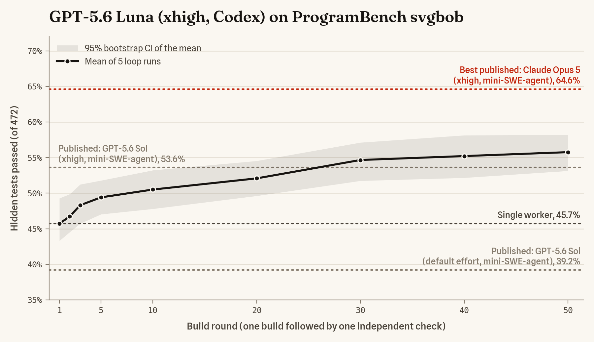
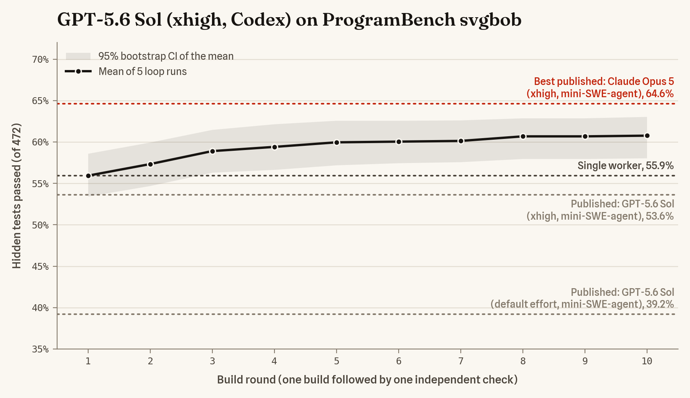

# Zeroshot on ProgramBench

A reproducible, fully containerized benchmark of a minimal Zeroshot graph on
[ProgramBench](https://github.com/facebookresearch/ProgramBench): rebuild a program from its
compiled reference executable and documentation, offline, then score the rebuild with
ProgramBench's hidden behavioral tests.

## Question

**H1 — "Don't trust, verify":** with the same model and the same generic builder prompt, does an
independent check-and-repair loop improve the hidden-test pass rate?

The first experiment (`experiments/luna-xhigh-svgbob.json`) runs GPT-5.6 Luna at `xhigh` effort on
`ivanceras__svgbob.6d00ad9` (ASCII diagrams to SVG; 472 scored tests; best public score 65%):

| Arm | Graph | Runs |
|---|---|---|
| `loop` | `build → check`, repeated until the check accepts (at most 4 rounds) | 5 |
| `single` | `build` once | 3 |

Runs are interleaved in a fixed, pre-registered order (`L S L L S L S L`), four at a time. Every
loop run is snapshotted when each build finishes, so the workspace after build 1 is a same-run,
single-worker baseline; the single arm checks that this baseline behaves like a real single run.

**Pre-registered decision rule** (also in the experiment file; computed in whole tests):

- **Eligibility:** a loop run counts only if it completed; its build-1 snapshot was archived and
  both it and the final workspace were scored on all tests (a workspace that fails to compile or to
  produce a usable executable scores 0, as on the leaderboard; an evaluation infrastructure error is
  re-evaluated once and disqualifies the run if it persists); build 1 ended normally or at its node
  time limit (a crash or malformed response cuts the baseline short); it has no disqualifying audit
  finding (binary instrumentation such as `LD_PRELOAD`, `LD_AUDIT`, `LD_DEBUG` or ptrace, direct
  model-API calls, proxy use by tools, process-environment reads, web search); its builder did not
  touch harness internals in round 1; neither scored workspace contains or builds the reference
  executable; and the Codex config, the harness files and the Codex home's instruction files were
  unchanged and checked after every node, with no transcript showing loaded `AGENTS.md`
  instructions. All 5 loop runs must be eligible, otherwise the verdict is *inconclusive*.
- **Supported:** every loop run gains at least 1 percentage point (above eval noise) and the median
  gain is at least 5 points.
- **Not supported:** the median gain is below 2 points. Otherwise *inconclusive*.
- Reported per run as covariates, not used for eligibility: whether the reference executable still
  existed after build 1 (a builder may overwrite it, leaving the checker only the documentation),
  rounds and verdicts, and cost.
- The final workspace counts even when the 6-hour cap force-stops a run. Attempts that fail for
  infrastructure reasons are re-run once (the runner refuses a second re-run); the discarded attempt
  is kept and reported.

A supported H1 shows that check-and-repair beats stopping after one build. It does not by itself
show that the checker's *independence* is what helps (the loop also spends more compute); that is
H2, a later experiment with a compute-matched self-review arm.

### Pilot result and the adjusted follow-up

`luna-xhigh-svgbob-v1` (standard ProgramBench conditions): **H1 not supported.** All 5 loop runs
were eligible; per-run gains were 0, −14.8, −15.5, +4.4 and +4.7 points (median 0). The loop helped
in the two runs whose builder kept the reference, and hurt where the builder had overwritten
`./executable` (the task's build target is the reference's own path). Without the reference,
checkers judged against the README, which contradicts the reference: it documents an Arial
default font where the program renders `Iosevka Fixed, monospace`, an `--inline` flag it lacks,
and a server mode that belongs to a separate program. Builders complied and lost about 70 tests
each time. This split is exploratory (2 runs against 3).

`luna-xhigh-svgbob-v2` keeps the model, prompts, graphs, limits and decision rule, runs all eight
attempts at once (4 CPUs and 7 GB each, instead of four at a time with 7 CPUs and 13 GB), and makes
two declared adjustments to the environment (`task.reference_path`, `task.doc_fixes` in the experiment file; applied by
`agent/prepare-task.py` when the image is built and recorded in the manifest):
- the reference moves to `/reference/executable`, a root-owned directory the agent can run it
  from but cannot overwrite, move or delete; the task statement points there, and the build
  target stays `./executable`;
- the three README statements that contradict the reference are corrected in place and folded
  into the workspace's initial commit. The reference's own `--help` text is unchanged (it also
  claims an Arial default), and the ambiguous `--scale` line is left as is.

Both adjustments deviate from standard ProgramBench conditions, so v2 answers a different question
(does the loop help when every node keeps the oracle and accurate documentation?) and is reported
next to v1, not instead of it.

v2 result: **H1 inconclusive** under the pre-registered rule. All 5 loop runs gained (+1.9, +2.1,
+10.8, +3.6 and +0.2 points; median 2.1, sign test p = 0.031), with no collapses, but one run
gained less than 1 point and the median is below 5. No checker ever accepted: every loop ran all 4
rounds.

`luna-xhigh-svgbob-v3` asks whether the gains keep compounding. It keeps v2's environment and
settings and raises the loop cap from 4 to 50 rounds (about 5 minutes and $0.12 per round in v2,
so 50 rounds fit the 6-hour cap). Every snapshot is archived, but a pre-registered schedule
(`eval.rounds`) scores only builds 1, 2, 3, 5, 10, 20, 30, 40 and 50 plus the final workspace; the
summary adds a learning-curve table. The H1 rule is unchanged (final against build 1).

v3 result: **H1 supported.** All 5 loop runs were eligible and all gained (+2.5, +14.0, +10.4, +7.2
and +16.1 points; at least 12 tests each, median 10.4). No checker ever accepted, so every loop ran
all 50 rounds (2.75 to 4.7 hours). The mean gain over build 1 was +3.7 points after 5 rounds, +4.8
after 10, +6.4 after 20, +8.9 after 30 and +10.0 after 50 (95% percentile bootstrap interval over
runs 5.8 to 14.1): most of it came by round 30, and three runs changed little over their last 10 to
30 rounds. The best run reached 60.0%. The single-worker finals scored 38.6, 41.7 and 44.3%. The
loops cost $6.73 to $9.42 each (about $0.15 per round) and the single runs $0.20 to $0.35.



`scripts/plot_pass_rate.py figures/luna-xhigh-svgbob-v3.json` draws the figure (needs matplotlib and
numpy). The published lines are single mini-SWE-agent runs from the ProgramBench submissions
repository, scored with the same ignore list.

`sol-xhigh-svgbob-v4` asks whether the loop also helps a stronger model. It keeps v3's environment,
prompts, graphs and limits, switches to GPT-5.6 Sol at xhigh, caps the loop at 10 rounds and scores
every round. It drops the single-worker arm: a single worker is exactly the loop's first build (the
builder's input is byte-identical in both arms), and the arms' first builds differed in both
directions across v1 to v3 (v3: single runs 196.0 against loop first builds 215.8 tests, exact
permutation p = 0.20). The H1 rule is unchanged (5 loop runs, final against build 1). At Sol's
promotional prices, v3's token use over its first 10 rounds would cost about $170 for 5 runs.

v4 result: **H1 inconclusive**, narrowly. All 5 loop runs were eligible and all gained (+4.2, +2.5,
+8.7, +4.7 and +4.0 points; at least 12 tests each; sign test p = 0.031), but the median gain of 4.2
points is below the pre-registered 5. No checker ever accepted: every loop ran all 10 rounds. Sol's
first builds averaged 55.9%, where Luna's loops ended after 50 rounds (55.8%). The mean gain was +3.0
points after 3 rounds, +4.0 after 5 and +4.8 after 10, about what Luna gained over its first 10
rounds, but Sol's came early and then flattened. The best run reached 63.6% (300 tests), just below
the best published result. The loops took 61 to 163 minutes and cost $22 to $64 each ($173 in
total; a first build cost about $3.75).



`opus5-xhigh-svgbob-v5` asks the same question of another model family and harness: v4's
environment, prompts, graphs, limits and H1 rule, with Claude Opus 5 at xhigh running in Claude
Code (the harness Zeroshot uses for Claude models) instead of GPT-5.6 Sol in Codex. Claude Code
needs its own isolation (see Environment and isolation); the smoke test proves each part in a real
run. Opus 5 at xhigh is far slower per round: the smoke's builds did not finish within 40 minutes,
the model was generating for 109 of its 120 minutes (about 90 tokens a second), and the published
single Opus 5 xhigh run on this task made 168 calls and 370K output tokens (Sol xhigh: 37 and 58K).
So v5 keeps all 10 rounds and drops the time cap (the attempt limit is a week; builds keep their
3-hour and checks their 1-hour limit). Each attempt's model gateway refuses further requests once the
attempt's API cost reaches $400, a safety net a run is not expected to reach; the smoke spent about
$13.50 per hour.

## The graph and prompts

Both arms share one byte-identical `build` node; round 1 of the loop is exactly the single arm.

```
loop "solve" (max 4 rounds; stop when check.verdict = accepted)
  build  — Codex, keeps its own session across rounds; input = task + feedback ("" in round 1)
  check  — Codex, fresh session every round; verdict accepted | rejected; its diagnostic
           becomes the builder's feedback for the next round
```

Failed rounds follow Zeroshot's normal semantics. A build that crashes or times out leaves the
workspace as it is, the check still runs, and the next round's builder starts a new thread (after a
malformed response it keeps its thread). A check
that errors records no verdict, so the loop continues and the builder receives the previous feedback
again (none, if the first check errors). Zeroshot retries a crashed check once, never a timeout or
an invalid response.

The only text we wrote is two generic role prompts, frozen before any run
(`prompts/builder.md`, `prompts/checker.md`):

> **Builder:** Complete the task described in the input. Keep working and verifying your own work
> until you believe the result fully satisfies the task. If review feedback is provided, address
> every point without breaking what already works.

> **Checker:** Independently judge whether the current workspace satisfies the task. Derive your own
> checks from the task statement and whatever it makes available; do not rely on the builder's
> tests, notes, or claims. Run the checks. Accept only with concrete evidence that nothing is wrong.
> Otherwise reject and list the most important discrepancies, each with a minimal reproduction.

Zeroshot wraps each prompt in its standard node guidance (for workers: install
manifest/lockfile dependencies and verify before returning; for verifiers: do not modify reviewed
material) and a JSON response contract. All task knowledge comes from the benchmark's own task
statement, `prompts/task.md`, generated by `scripts/build_task_prompt.py` from the upstream
mini-SWE-agent ProgramBench prompt (`prompts/upstream/`, SWE-agent/mini-swe-agent `main` at
`04d809ce`). The script removes only scaffold mechanics (the persona line, the one-bash-command
protocol, the submit sentinel, command examples); every other line is verbatim. The unit tests
re-derive it byte-for-byte.

## Environment and isolation

- **Task environment:** the official ProgramBench task image, pinned by digest, unchanged except
  for Zeroshot and Codex's full platform package (checksum-pinned releases) and a Codex config.
  The agent runs as the image's non-root `agent` user; the reference executable is execute-only.
  The image's own sudo rules (package managers, cargo, go) are left as ProgramBench ships them.
  Their install hooks amount to root, so the harness files (Zeroshot, Codex, Codex's system config)
  are fingerprinted at the start, after every node and at the end, and a change disqualifies the run.
- **Network:** every attempt gets its own internal Docker network whose only exit is its own
  tinyproxy, which allows HTTPS `CONNECT` to `api.openai.com` and nothing else. Tool commands get
  no proxy settings and no DNS, so they have no route out, like the upstream `--network none`;
  only Codex itself reaches the model API. Codex web search is disabled (it runs server-side and
  would bypass the proxy). Codex's own background requests (github.com, chatgpt.com) are refused
  and logged.
- **Secrets:** the API key reaches Zeroshot only through `docker exec -e OPENAI_API_KEY`. Tool
  commands cannot see it: the Codex config applies its credential exclusions and turns off the shell
  snapshot (which otherwise re-exports the whole environment into tool shells), and the Zeroshot and
  Codex executables are root-owned and execute-only, so the kernel marks the processes the harness
  starts from them non-dumpable and their `/proc/<pid>/environ` and memory are unreadable to the
  agent (a readable copy of Codex would expose its key). A process that `docker exec` starts
  directly stays dumpable even from an execute-only file, so the runner starts the key-holding
  submitter through a shell's `exec`. Codex's code-mode JavaScript runs in a bare V8 isolate that
  exposes only Codex's tool functions, with no environment, file or network access. The smoke test
  proves each point from inside a real run and checks the submitter's launch path on the host. Every
  artifact — plain files, archive members, nested archives, and the decompressed git objects of
  archived repositories — is scanned for the literal key; a hit writes `DO-NOT-PUBLISH.txt` and
  fails the command.
- **Node independence:** every node starts from its prompt and this configuration alone. Left alone,
  Codex marks `/workspace` trusted on first use and then loads `AGENTS.md` files and
  `.codex/config.toml` layers from the workspace into every later node, so a builder could instruct
  the checker or undo the settings above. The Codex config pins the workspace as untrusted, which
  leaves the explicit sandbox and approval settings in force; the smoke test plants a canary
  `AGENTS.md` to prove it is never loaded. The Codex home (`~/.codex`) is shared by all nodes and
  Codex also reads user instructions, skills, rules and hooks from it, so after every node the
  runner records those files and the config (none but the config exist at the start) along with the
  harness fingerprint; any change, or any transcript that shows loaded `AGENTS.md` instructions,
  makes a loop run ineligible. Codex memories are off as well.
- **Harness integrity:** Zeroshot resolves `codex` through the `PATH` it starts with, for every
  node, and the task image puts the world-writable `/usr/local/cargo/bin` first. The runner
  therefore starts Zeroshot by absolute path, and runs every harness command (probes, archives,
  Zeroshot calls), with a `PATH` of root-owned directories only, so no node can plant a `codex` that
  a later node would run with the key, or a `tar` or `sha256sum` that would spoof the checks meant
  to catch it; tool shells keep the image's `PATH`. The smoke test plants decoys of all of these
  there and requires that none ever runs.
- **Tooling parity:** Zeroshot starts Codex with a minimal environment, so the rendered Codex
  config mirrors the task image's ENV (`CARGO_HOME`, `RUSTUP_HOME`, …) into tool commands. It
  also gives them the image's plain `/tmp` as `TMPDIR`, instead of a directory inside Zeroshot's
  run state.
- **Claude Code (v5):** Zeroshot starts `claude` for every node through a root-owned launcher that
  always adds `--safe-mode` and `--setting-sources ""` (no settings files, `CLAUDE.md`, hooks,
  skills, plugins, MCP servers, custom agents or commands from the workspace or from `~/.claude`),
  disables auto memory, telemetry and auto-update, and removes the web tools (Anthropic runs web
  search server-side, outside any egress control) and the tools that message other sessions or
  schedule work. Without these, Claude Code runs a workspace's hooks and loads its `CLAUDE.md` into
  every later node; the smoke test plants both, in the workspace and in `~/.claude`, and requires
  that none takes effect. Claude Code gives tool commands its own environment, and without
  bubblewrap (the container has no user namespaces) it cannot remove the key from it, so the key
  never enters the attempt container: Claude Code sends a placeholder key to the attempt's model
  gateway, a small Python server in the network's exit container that holds the real key, forwards
  to `api.anthropic.com` only, refuses server-side tools, logs each request's model, tools and
  usage, and enforces the spending cap. The attempt container has no proxy settings and no other
  route out. Every model response in the transcripts must appear in the gateway log, and a Claude
  session that Zeroshot did not start (a tool launching `claude`) disqualifies the run. Tool
  commands get the task image's environment with root-owned directories first on `PATH`.
- **Archives:** workspace archives are made as the `agent` user, like the upstream baseline, so the
  execute-only reference is never archived wherever the agent moves it. Agents do move it (the task
  asks them to build `./executable` at the same path), so every snapshot records where the
  reference is, by hash.

Residual risks, documented rather than engineered away: filtering is by CONNECT host name, not TLS
SNI; ProgramBench's eval runs agent-written code in networked test containers (use a host without
a cloud instance role and with the metadata endpoint's hop limit at 1, as for the pilot).

## Reproduce

Requirements: Linux x86_64, rootful Docker 26 or newer, and an OpenAI API key with access to the
model. The reference host for the pilot is 32 vCPU / 64 GB / Ubuntu 24.04 / Docker 29: v1 runs four
attempts of 7 CPUs and 13 GB at a time, v2 all eight at once with 4 CPUs and 7 GB each. The runner
refuses hosts that cannot fit the configured concurrency, and requires 60 GiB of free disk.

```bash
git clone --branch benchmark/programbench https://github.com/the-open-engine/zeroshot.git
cd zeroshot/benchmarks/programbench
read -rs OPENAI_API_KEY && export OPENAI_API_KEY   # or scripts/push-openai-key.sh user@host for a remote box
scripts/zsbench smoke                               # ~30 min plus image pulls, about $1: isolation, diagnostics, pipeline, scoring fidelity
scripts/zsbench run experiments/luna-xhigh-svgbob.json
```

For v2, use `scripts/zsbench smoke experiments/smoke-v2.json` and `scripts/zsbench run
experiments/luna-xhigh-svgbob-v2.json`.

To reproduce a published result exactly, check out the commit recorded in its `manifest.json`
(`provenance.vcs_ref`) rather than the branch tip.

`scripts/zsbench` builds the runner image (`Dockerfile`) and runs it with the host Docker socket
mounted. It records the exact commit and refuses a paid `run` from a dirty or non-git tree (override
with `ZSBENCH_ALLOW_DIRTY=1`). A key from the environment reaches the runner as a temporary
read-only file, never as container config. Long runs: `ZSBENCH_DETACH=1 scripts/zsbench run …`,
follow with `docker logs -f zsbench-runner`, and stop with `docker stop -t 1800 zsbench-runner` so
attempts are wound down and recorded; evaluation is then skipped, and running the same command again
resumes (stopped attempts start over, completed ones are kept). The runner refuses to resume into
results from a different experiment digest (`--allow-mixed` overrides), refuses to start while
another runner's containers are running (`scripts/zsbench cleanup <experiment>` removes them) or
when the configured concurrency would oversubscribe the host's CPUs, and hands results back to the
invoking user. `eval` and `report` re-score existing attempts with the current code and record that
code in the manifest and summary. To re-run the smoke test, move `results/smoke` aside first. Other
settings: `ZSBENCH_RESULTS_DIR`, `ZSBENCH_SECRET_FILE`, `ZSBENCH_DOCKER_SOCK`, `ZSBENCH_IMAGE`;
`--keep-containers` and `--skip-eval` for `run`. The runner runs under an init process, so a stop
outside the attempt phase ends it at once (results are still handed back); `run`, `smoke`, `cleanup`
and `eval` refuse to run while another runner is live.

Other commands: `plan` (render graphs and the attempt order), `check-key`, `eval` (re-score),
`report`, `cleanup`. Unit tests (Python 3.12): `python -m unittest discover -s tests`, or inside
the runner image.

## Results layout

```
results/<experiment id>/
  manifest.json          provenance (commit, dirty flag, runner image, digest), pins, image IDs,
                         eval image, rendered Codex config, prompts, host, invocation history
  summary.md|json        per-run table, per-arm aggregates, H1 decision, baseline check, audits
  scores.json            leaderboard-comparable score for every final and snapshot
  scores-per-test.json   pass/fail per hidden test
  eval-runs.json         programbench eval invocations and exit codes
  run.log, programbench-eval.log
  attempts/NN-arm/
    attempt.json         timing, terminal status, verdicts, snapshots (timing, reference location),
                         errors, provenance
    run/                 the exact graph, runtime plan, and input submitted
    watch.ndjson         Zeroshot status projections
    snapshots/           workspace after each build (build-N) and each check (check-N)
    submission.tar.gz    final workspace
    trajectories.tar.gz  Codex sessions, Codex config, and the Zeroshot ledger
    proxy.log            this attempt's egress (allowed and refused)
    receipt.json, status.json, workspace-git-log.txt
  attempts/NN-arm.discarded-<time>/   attempts replaced by a re-run
  evals/                 programbench eval outputs per archive
```

## Scoring and cost

- **Evaluation once per workspace:** a check snapshot usually holds the same code as the build
  before it, and a final the same as the last snapshot. Archives are grouped by their files'
  contents, modes and link targets (timestamps ignored); one representative per group is evaluated
  and its result is shared, recorded as `evaluated_as` in `scores.json` and in
  `evals/representatives.json`. In v1 this is 23 evaluations for 51 archives, and identical
  workspaces scored identically.
- **Score:** `programbench eval` 1.2.4 (the leaderboard's version) on the task image pinned by
  digest, with the hidden tests pinned to Hugging Face revision `de0ddfb6` and
  `pytest-rerunfailures` pinned to 16.4 (`bench/pbeval.py`; newer releases emit phantom passing
  entries, which upstream fixed the same way). Scores use ProgramBench's own
  `test_results_map`/`score_from_tests` with the leaderboard registry's ignore list at `794fa30`.
  The smoke test re-scores a pinned, published leaderboard submission on the same task and
  requires agreement within 2 points (observed: 53.8% vs 53.6%, one test).
- **Cost:** priced from Codex's own session transcripts (each is one thread; its cumulative usage
  splits into rounds at each node prompt) with the experiment's pricing table (input, cache reads, cache writes,
  output). Zeroshot's ledger is reported alongside but not used: it double-counts a resumed
  thread's earlier turns.
- **Audits:** the shell commands Codex actually ran (from its transcripts, not the code-mode
  JavaScript around them) are scanned per node and round (one graph execution, which can span
  several Codex turns), along with web-search calls and, for
  instrumentation code, the files the agent wrote. Disqualifying findings are the channels that
  could carry withheld information: instrumenting a binary (`LD_PRELOAD`, `LD_AUDIT`, ptrace, the
  only way to look inside the execute-only, dynamically linked reference), calling the model API,
  using the proxy, reading process environments, and web search. Reported for human review:
  static analysis of anything named `executable` (the task allows it on the builder's own
  binaries; on the reference it fails with a permission error, and such attempts are counted
  separately), moving the reference, network fetch attempts, sudo, reading cached dependency
  sources (the image holds no svgbob source), and touching harness internals. Check rounds are
  diffed against the preceding snapshot to confirm verifiers did not edit sources, and every scored
  archive and built executable is compared with the reference by hash.

## Known deviations from the public leaderboard setup

- **Harness:** Zeroshot driving the Codex CLI, not mini-SWE-agent. Compare arms within this
  benchmark; leaderboard numbers are context.
- **Network:** the model API is reachable by Codex (see above); Codex's system prompt also says
  network access is enabled, while the task statement says it is not.
- **Task wording:** the task statement comes from mini-swe-agent `main` (`04d809ce`). Released
  mini-swe-agent versions used by leaderboard runs (v2.2.x–v2.4.x) phrase the same rules
  differently ("This is a reverse-engineering benchmark…").
- **Limits:** 6 hours wall clock per attempt (as upstream); 3 hours per build node, 1 hour per
  check; no step limit. A loop can reach the 6-hour cap before 4 rounds, which only the loop arm
  can hit.
- **Single-arm prompt:** the shared builder prompt mentions review feedback, which the single arm
  never receives.
- **Scope:** one task. Generality needs a follow-up panel of tasks drawn at random.
- **v2 environment:** the reference executable lives outside the workspace and three README
  statements are corrected (see above); v1 uses the unmodified task.
- **Served model:** OpenAI serves `gpt-5.6-luna` by name; transcripts do not identify a model
  snapshot, so a reproduction assumes the same served model.
